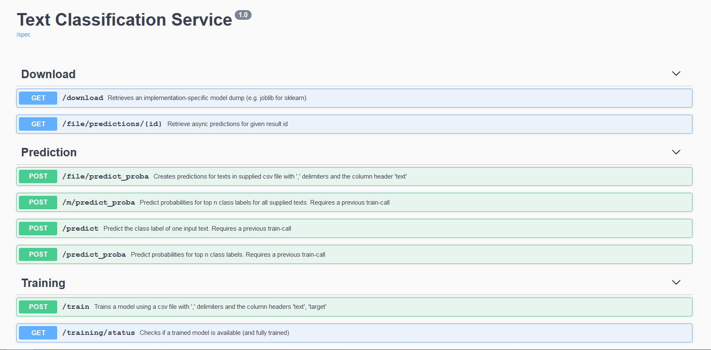

# zimp_clf_service
RESTful classification service used for experiments in the zimp pipeline

## Supported Models
Configure desired model in `config.py`
* Sklearn SVM
* FastText
* Huggingface DistillBert

## Startup
1. `pip install -r requirements.txt`
2. `python -m flask run`
3. Goto 127.0.0.1:5000 and check the api reference

## API

